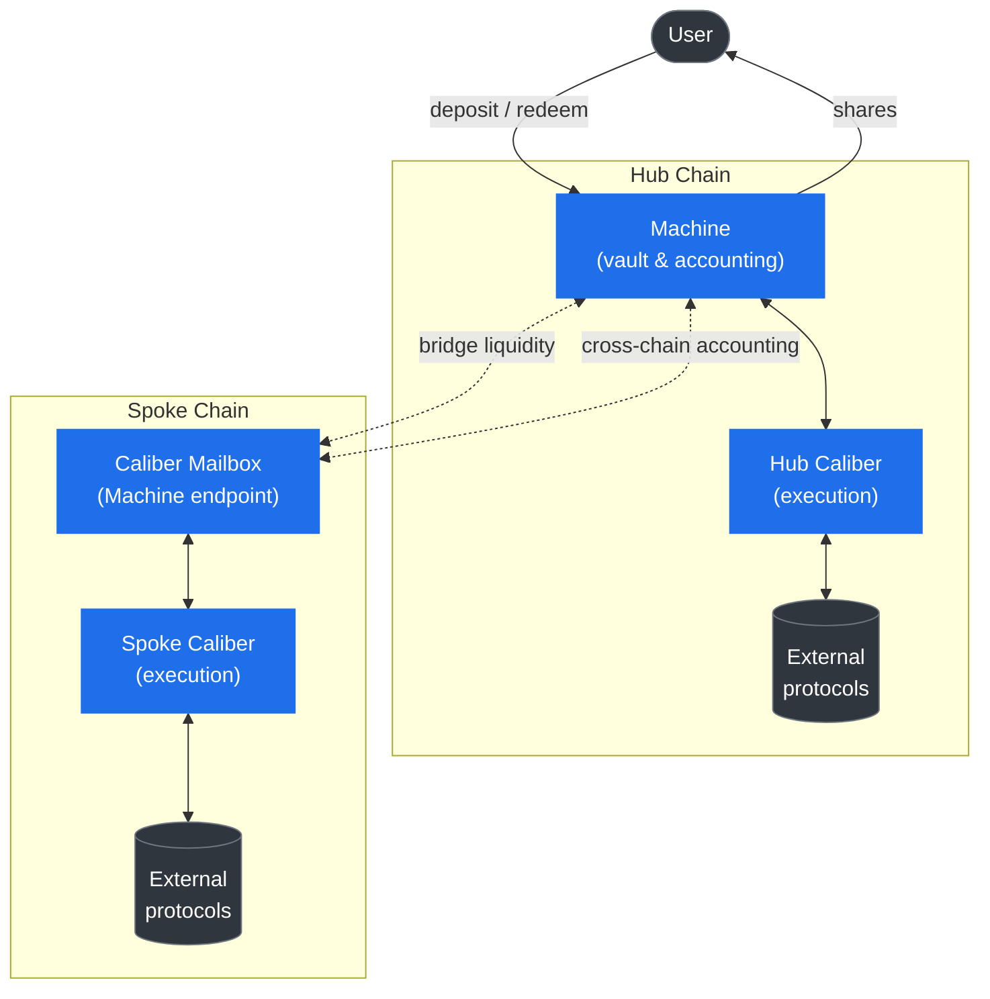

# Architecture

This page builds the mental model you'll use for the rest of the documentation: the major components, how they fit together, and the vocabulary the protocol uses. Read it once and the deeper sections will slot neatly into place.

## The two core components

Every Makina strategy is built from two kinds of contract:

- **The [Machine](machine/overview)** is the _vault and accounting layer_. It lives on a single chain (the **Hub Chain**) and is the strategy's front door: it accepts deposits, issues the [share token](machine/machine-token), computes the [share price](machine/share-price), charges [fees](machine/fees), and aggregates the value of everything the strategy holds (including capital on other chains) into one number, the **AUM** (assets under management).
- **The [Caliber](caliber/overview)** is the _execution layer_. A Caliber is where assets are actually deployed into external protocols. It opens and manages [positions](caliber/positions), [swaps](caliber/swaps) tokens, [harvests](caliber/harvests) rewards, and reports the value of everything it holds back to the Machine.

A strategy always has **one Machine**, and **one Caliber per chain** it operates on. The Caliber on the Hub Chain sits next to the Machine. Additional Calibers on other chains (**Spoke Chains**) extend the strategy across the multi-chain landscape.

## Core vs. periphery

The contracts are organized into two repositories, and the distinction is worth understanding early:

- **Core** ([makina-core](/contracts/core/summary)) is the trust-critical engine: the Machine, the Calibers, the cross-chain bridging and accounting plumbing, and the shared registries that price assets and resolve dependencies. Core contracts hold and move the funds.
- **Periphery** ([makina-periphery](/contracts/periphery/summary)) comprises the modular contracts that surround a Machine and can be swapped per strategy: the [Depositor](machine/deposits) (entry point), the [Redeemer](machine/redemptions) (exit queue), the [Fee Manager](machine/fees) (fee policy), and the [Security Module](security/security-module) (insurance backstop).

The split matters because it is _how Makina stays flexible_. Different strategies need different deposit rules, redemption flows, and fee models. Rather than baking those into the Machine, the Machine delegates them to interchangeable periphery contracts. The Machine only knows "my depositor", "my redeemer", "my fee manager", and each can be a different implementation.

## Shared infrastructure

Alongside the per-strategy contracts, a set of **protocol-wide infrastructure** contracts are deployed once per chain and shared by every strategy:

- The **[Oracle Registry](oracles)** prices any token against the strategy's reference asset using Chainlink-compatible price feeds, the foundation of all accounting.
- The **[Token Registry](/contracts/core/registries/TokenRegistry.sol/contract.TokenRegistry.md)** maps a token to its equivalent address on each foreign chain, so the protocol can reason about "the same token, on another chain."
- The **[Chain Registry](/contracts/core/registries/ChainRegistry.sol/contract.ChainRegistry.md)** maps EVM chain IDs to the chain identifiers used by Wormhole CCQ, the cross-chain queries that carry [spoke accounting](cross-chain/cross-chain-accounting) back to the Hub.
- The **Swap Module** routes [swaps](caliber/swaps) through approved external aggregators.
- **Registries and factories** deploy new strategies and let the protocol resolve and upgrade shared dependencies. See [Protocol Upgrades](governance/protocol-upgrades).

These are covered in [Pricing & Oracles](oracles) and the [Contracts](/contracts/core/architecture-overview) reference.

## How the pieces interact

Three flows tie the system together. Each has its own section, summarized in one paragraph here.

**Capital flow.** Users deposit the [accounting token](#glossary) through the [Depositor](machine/deposits) and receive shares. The [Operator](governance/operator) moves idle capital from the Machine into Calibers (and across chains via [bridging](cross-chain/liquidity-bridging)), where it is deployed into [positions](caliber/positions). To exit, users request a redemption through the [Redeemer](machine/redemptions). The Operator frees up liquidity and the redemption is settled. See [Asset Lifecycle](lifecycle).

**Accounting flow.** Each Caliber values everything it holds in the accounting token. The Machine sums the value of its idle balance, the Hub Caliber, and every Spoke Caliber to produce the strategy's total AUM, from which the share price is derived. Because Spoke Calibers live on other chains, their values are brought to the Machine through [Wormhole Cross-Chain Queries](cross-chain/cross-chain-accounting). See [Share Price](machine/share-price).

**Control flow.** The Operator executes the strategy but only within bounds: a pre-approved [instruction set](caliber/makina-vm), per-position [risk caps](governance/risk-manager), loss limits, and cooldowns. The [Risk Manager](governance/risk-manager) sets those bounds (most changes pass through a timelock), and the [Security Council](governance/security-council) can veto changes and trigger [Recovery Mode](security/recovery-mode). See [Roles & Governance](governance/overview).

## Glossary

| Term                      | Meaning                                                                                                                                                                                                                                                                                                                                                                     |
| ------------------------- | --------------------------------------------------------------------------------------------------------------------------------------------------------------------------------------------------------------------------------------------------------------------------------------------------------------------------------------------------------------------------- |
| **Machine**               | The per-strategy vault on the Hub Chain. Handles deposits, redemptions, shares, fees, and total AUM. See [Machine](machine/overview).                                                                                                                                                                                                                                       |
| **Caliber**               | The per-chain execution engine that deploys assets into external protocols. See [Caliber](caliber/overview).                                                                                                                                                                                                                                                                |
| **Hub Chain**             | Ethereum Mainnet, where every strategy's Machine lives.                                                                                                                                                                                                                                                                                                                     |
| **Spoke Chain**           | Any additional chain a strategy operates on, hosting a Caliber and a Caliber Mailbox.                                                                                                                                                                                                                                                                                       |
| **Share / Machine Token** | The ERC-20 token representing a proportional claim on the strategy. Its value is the share price. See [Machine Token](machine/machine-token).                                                                                                                                                                                                                               |
| **Accounting Token**      | The single asset a strategy is denominated in (e.g. USDC, WETH). The only token users deposit and redeem, and the unit in which all value is measured.                                                                                                                                                                                                                      |
| **Base Token**            | A token a Caliber may hold directly and that is priceable against the accounting token. The "raw materials" positions are built from. See [Base Tokens](caliber/base-tokens).                                                                                                                                                                                               |
| **AUM**                   | Assets under management: the total value of everything a strategy controls, in accounting-token terms.                                                                                                                                                                                                                                                                      |
| **Position**              | A deployment of capital into an external protocol, tracked and valued by a Caliber. Can be an asset or a debt. See [Positions](caliber/positions).                                                                                                                                                                                                                          |
| **Instruction**           | A pre-approved, governance-committed action the Operator may execute via the [MakinaVM](caliber/makina-vm).                                                                                                                                                                                                                                                                 |
| **Operator**              | The entity that executes the strategy day to day. _Onchain, this role is held by an address the contracts call the `mechanic`. The `operator()` getter returns that address normally, and the Security Council's address while [Recovery Mode](security/recovery-mode) is active._ Throughout these docs we use the term **Operator**. See [Operator](governance/operator). |
| **Risk Manager**          | The entity that sets and adjusts a strategy's risk parameters and proposes new instructions, mostly through a timelock. See [Risk Manager](governance/risk-manager).                                                                                                                                                                                                        |
| **Security Council**      | The emergency oversight body that can veto risk changes and trigger Recovery Mode. See [Security Council](governance/security-council).                                                                                                                                                                                                                                     |
| **Recovery Mode**         | An emergency state that strips the Operator of normal powers and restricts the strategy to unwinding only. See [Recovery Mode](security/recovery-mode).                                                                                                                                                                                                                     |

:::tip Next
Continue to [Asset Lifecycle](lifecycle) to follow a deposit through the entire system, from share minting to redemption.
:::
