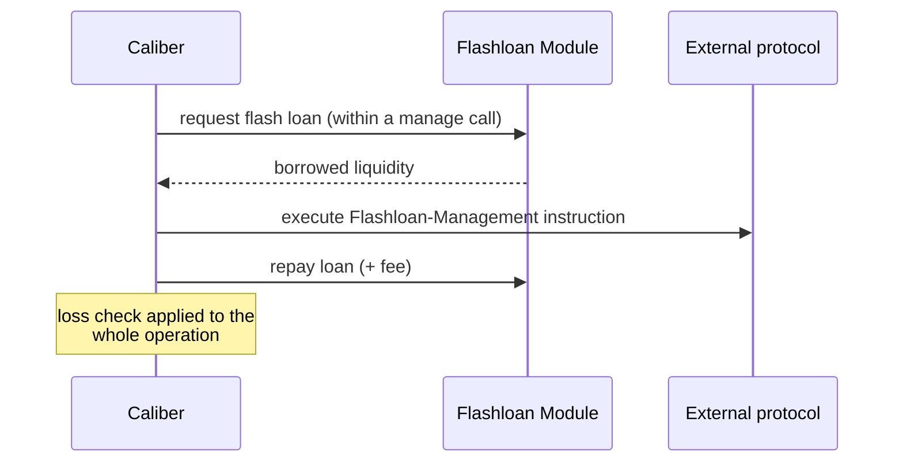

# Flash Loans

Some position-management operations need more liquidity, momentarily, than the [Caliber](overview) holds: opening a leveraged or looped lending position, unwinding such a position in one shot, or rebalancing across a DEX pool. A **flash loan** supplies that temporary liquidity within a single transaction.

## How it fits the instruction model

A flash loan wraps a [Management instruction](makina-vm#the-four-instruction-types):

The borrowed funds are made available before the inner instruction runs and must be repaid by the end of it. The inner step is a dedicated **Flashloan-Management** instruction type, which is only valid _inside_ an outer Management instruction, and cannot be executed on its own.

The Caliber reaches flash-loan providers through an external **Flashloan Module** that adapts the differing callback interfaces of various lending protocols into one consistent entry point.

## Same guardrails apply

A flash loan doesn't bypass any of the Caliber's safety properties. The inner instruction must still match the approved [Merkle root](makina-vm#merkle-tree-permissioning), and the [loss check](positions#loss-checks) is applied to the operation as a whole, so the temporary liquidity cannot be used to move value outside the configured tolerance.

:::info Implementation
The flash-loan aggregation logic lives in the periphery [`FlashloanAggregator`](/contracts/periphery/flashloans/FlashloanAggregator.sol/contract.FlashloanAggregator.md).
:::
