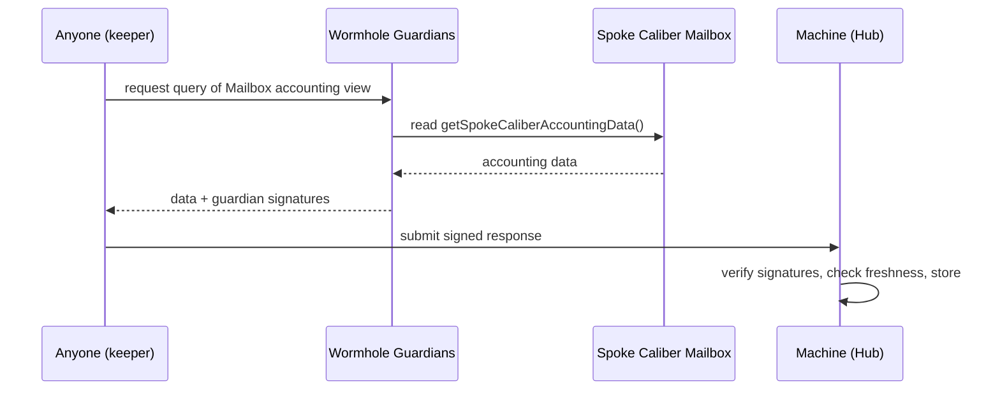

# Cross-Chain Accounting

For the [share price](../machine/share-price) to be correct, the [Machine](../machine/overview) must know the value of **every** Caliber, including those on other chains. Reading the Hub Caliber is a local call. Reading a Spoke Caliber is the hard part, because it lives on a different chain. Cross-chain accounting is how that value is brought to the Hub **without trusting any single party to report it honestly**.

## Wormhole Cross-Chain Queries (CCQ)

Makina uses [Wormhole Cross-Chain Queries](https://wormhole.com/products/queries), a **pull-based** mechanism backed by Wormhole's decentralized guardian network:

1. Each [Caliber Mailbox](caliber-mailbox) exposes a **view function** returning its Caliber's detailed accounting: net AUM, per-position values, base-token values, and pending bridge amounts.
2. The guardian network reads that view on the spoke chain and returns the result **with their signatures** and a timestamp.
3. Anyone can relay that signed response to the Machine. The Machine **verifies the guardian signatures**, checks the data is **fresh** (within a configured staleness threshold), and stores it.

Because the data is guardian-signed and freshness-checked, submission is permissionless: a relayer cannot forge or replay a Spoke's value.

## From spoke data to total AUM

Once the Machine holds fresh accounting for every spoke, it can compute total AUM (see [Share Price](../machine/share-price)):

$$
\text{AUM} = \text{idle} + \text{Hub Caliber} + \sum \text{Spoke Calibers} + \text{in-flight bridges}
$$

If any spoke's stored data is stale when an [AUM update](../machine/share-price#keeping-aum-fresh) is attempted, the update **reverts** rather than using outdated values, so the share price is never computed from stale cross-chain data.

## Counting value in transit

The accounting data each Mailbox reports includes **pending bridge amounts**: capital that has left one side but not yet arrived on the other. The Machine tracks bridge transfers in both directions on both sides, and counts the in-flight difference toward AUM. This is what guarantees value isn't double-counted _or_ dropped while a [bridge transfer](liquidity-bridging) is in progress, which can take anywhere from minutes to days.

:::info Implementation
The CCQ decoding and verification logic lives in [`CaliberAccountingCCQ`](/contracts/core/libraries/CaliberAccountingCCQ.sol/library.CaliberAccountingCCQ.md). The spoke-side view is on [`CaliberMailbox`](/contracts/core/caliber/CaliberMailbox.sol/contract.CaliberMailbox.md).
:::
