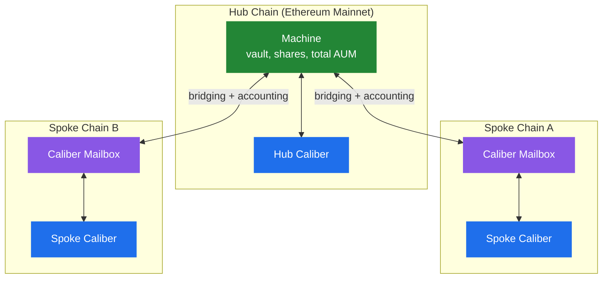

# Hub-and-Spoke Model

Makina strategies are **cross-chain by design**. A single strategy can hold capital and run positions on many chains at once, while presenting users with one machine token, one share price, and one place to deposit and redeem. The architecture that makes this possible is **hub-and-spoke**.

## The topology

- The **Hub Chain** is the single home of the [Machine](../machine/overview). It is where users deposit and redeem, where shares are minted, and where the strategy's total AUM and share price are computed. It also hosts the strategy's **Hub Caliber**.
- Each **Spoke Chain** hosts a [Caliber](../caliber/overview) plus a [Caliber Mailbox](caliber-mailbox). The Caliber executes the strategy locally, and the Mailbox is its connection back to the Machine.

Ethereum Mainnet acts as the Hub Chain.

## Why a Mailbox on each spoke

A Spoke Caliber works exactly like the Hub Caliber, except it can't talk to the Machine directly, because the Machine is on another chain. The **Caliber Mailbox** stands in as the Machine's local endpoint: from the Spoke Caliber's point of view, the Mailbox _is_ the Machine. It handles the bridging and reporting that connect the Spoke back to the Hub, so the Caliber's logic is identical everywhere. See [Caliber Mailbox](caliber-mailbox).

## Two cross-chain problems to solve

Spanning chains creates two distinct challenges, each with its own mechanism:

1. **Moving value across chains.** Capital must travel between the Hub and the Spokes, and value must never appear lost while it's in transit. This is handled by [Liquidity Bridging](liquidity-bridging), a deliberate, multi-step process over approved bridge adapters, with in-flight transfers explicitly tracked in AUM.
2. **Knowing value across chains.** The Machine must learn what each Spoke Caliber is worth in order to compute total AUM, without trusting a single reporter. This is handled by [Cross-Chain Accounting](cross-chain-accounting), which uses Wormhole's guardian-signed Cross-Chain Queries to pull each Spoke's accounting to the Hub.

The next pages cover each in turn.

## Shared cross-chain infrastructure

Reasoning about "the same token on another chain" and "which chain is which" requires shared maps, deployed once per chain:

- the **Token Registry** maps a local token to its equivalent address on each foreign chain;
- the **Chain Registry** maps EVM chain IDs to the identifiers used by Wormhole CCQ.

These are what let bridging and accounting refer unambiguously to assets and chains across the whole deployment.
