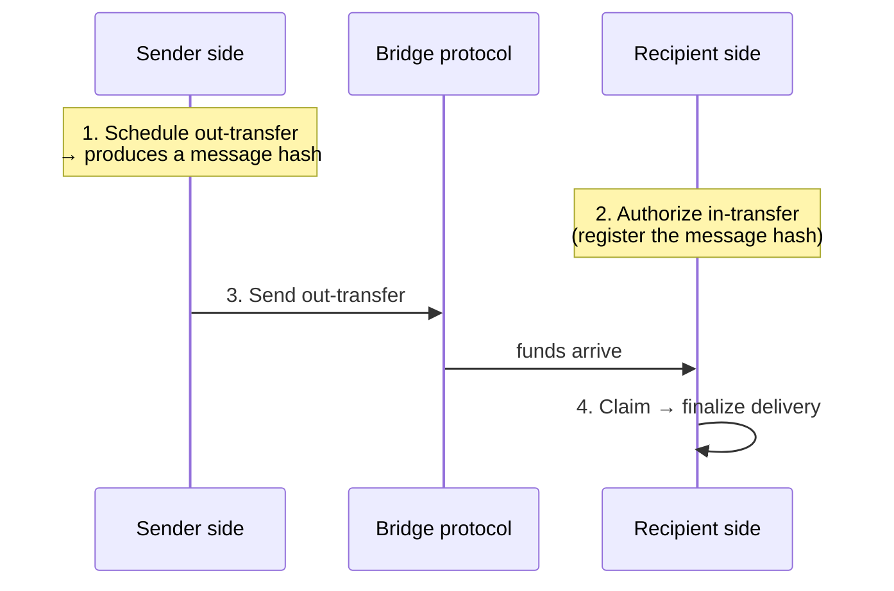

# Liquidity Bridging

Liquidity bridging moves the strategy's **capital** between the [Machine](../machine/overview) on the Hub Chain and its [Calibers](../caliber/overview) on the Spoke Chains. It is how an [Operator](../governance/operator) deploys fresh deposits to a spoke, and how funds are brought back to Hub to settle [redemptions](../machine/redemptions).

## Adapters abstract the bridges

Transfers ride on **external bridge protocols**. The protocol ships a dedicated **bridge adapter** for each supported bridge (Across, CCTP, and LayerZero). On the Hub side the adapters are managed by the Machine, and on a spoke by the [Caliber Mailbox](caliber-mailbox). Each adapter exposes a standardized interface, so the rest of the system doesn't need to know which bridge is in use. Which routes (chain + token + bridge) are allowed is governed configuration.

## A deliberate four-step transfer

Bridging is intentionally **not** a single fire-and-forget call. It is a four-step handshake, executed by the Operator, and it works the same in both directions (Hub → Spoke and Spoke → Hub):

1. **Schedule** the outgoing transfer on the sender side, which produces a unique **message hash** committing to the transfer's details.
2. **Authorize** the incoming transfer on the recipient side by pre-registering that message hash. The recipient will only accept a transfer it has explicitly expected.
3. **Send** the funds through the bridge protocol.
4. **Claim** on the recipient side to finalize delivery into the Caliber or Machine.

Requiring the recipient to pre-authorize the exact message hash means it only ever accepts transfers it has explicitly expected. An incoming transfer that was not authorized in advance is rejected.

## Loss limits

Each transfer carries a **minimum output amount**, and bridging is bounded by a governance-set **maximum bridge loss** (in basis points): a scheduled transfer whose expected output falls outside the allowed band is rejected. This caps the value that bridge fees or slippage can consume, and the per-bridge **outgoing-transfer-enabled** switch lets governance pause a route entirely.

## In-flight value is never lost

Between _send_ and _claim_, capital is in transit and belongs to neither side's balance. The protocol tracks these pending transfers and counts them in [AUM](../machine/share-price), so the [share price](../machine/share-price) stays correct even while funds are crossing chains. See [Cross-Chain Accounting](cross-chain-accounting).

:::warning Token homology
The protocol assumes the input and output tokens of a transfer are **homologous and share the same number of decimals**. This relies on the **Token Registry**, which maps each local token to its equivalent foreign address and must be configured correctly on every chain. Misconfiguration here would break the value equivalence that transfers and accounting both rely on.
:::

## In Recovery Mode

During [Recovery Mode](../security/recovery-mode), bridging is restricted to the **Spoke → Hub** direction. The Hub can no longer send transfers out to spokes, and spokes can no longer authorize incoming transfers from the Hub, so an emergency can only pull capital to Hub, never push it out to a spoke.

:::info Implementation
See the [bridge adapters](/contracts/core/summary) and [`BridgeController`](/contracts/core/bridge/controller/BridgeController.sol/abstract.BridgeController.md).
:::
