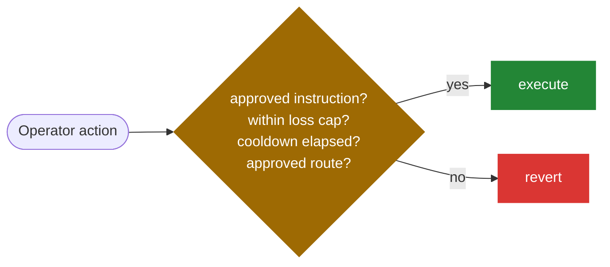

# Operator

The **Operator** is the entity that runs a strategy day to day. It is the actor with discretion (the one making the active-management decisions that generate returns), but that discretion is tightly bounded by the strategy's risk policy and the [pre-approved instruction set](../caliber/makina-vm).

:::note
In the contracts this role is the `mechanic` address. The `operator()` getter returns it during normal operation, and the [Security Council](security-council) during [Recovery Mode](../security/recovery-mode). We call it the **Operator** throughout. See the [governance overview](overview#the-per-strategy-actors).
:::

## Responsibilities

- **Execute and maintain the strategy**: open, resize, and close [positions](../caliber/positions), [swap](../caliber/swaps) tokens, [harvest](../caliber/harvests) rewards, and [rebalance](../lifecycle#4-rebalance--harvest-the-strategy-is-actively-managed) across protocols and chains to deliver strong risk-adjusted returns.
- **Move liquidity**: allocate idle capital from the [Machine](../machine/overview) to Calibers and [bridge](../cross-chain/liquidity-bridging) it between the Hub and Spokes.
- **Settle redemptions**: free up accounting-token liquidity and [finalize the redemption queue](../machine/redemptions).
- **Keep accounting fresh**: re-account positions so the [share price](../machine/share-price) stays accurate.
- **Propose new opportunities**: author new instructions and submit [Root Updates](root-update-lifecycle) for the Risk Manager to publish.

The Operator works toward the strategy's published [mandate](../introduction#the-strategy-mandate), and is incentivized by [performance fees](../machine/fees) to maximize the long-term share price.

## Trust assumptions

Makina assumes Operators are competent and economically motivated to perform, but **does not assume they are infallible or honest**. An Operator's keys could be compromised, its software could have bugs, or it could act maliciously. The protocol is therefore designed so that even a fully hostile Operator cannot cause large or fast losses.

## What the Operator _cannot_ do

The Operator never has custody in the ordinary sense. Its actions are constrained on every axis:

- **Execution** is limited to [pre-approved instructions](../caliber/makina-vm), and cannot call arbitrary contracts.
- **Swaps** may only output approved [base tokens](../caliber/base-tokens).
- **Bridging** is allowed only to approved chains over approved bridges, within a max-loss limit.
- **Loss caps and cooldowns** bound every position-management action and every swap.
- It **cannot** withdraw user funds, send assets to arbitrary destinations, change its own limits, or mint shares to itself outside the [fee](../machine/fees) mechanism.

Together these bounds mean an Operator cannot drain or wreck a strategy in a single transaction or a short burst. The damage rate is capped, which buys the [Security Council](security-council) time to detect anomalies, trigger [Recovery Mode](../security/recovery-mode), and strip the Operator of its powers. The Makina Foundation runs active monitoring across strategies to surface unusual behavior quickly.
