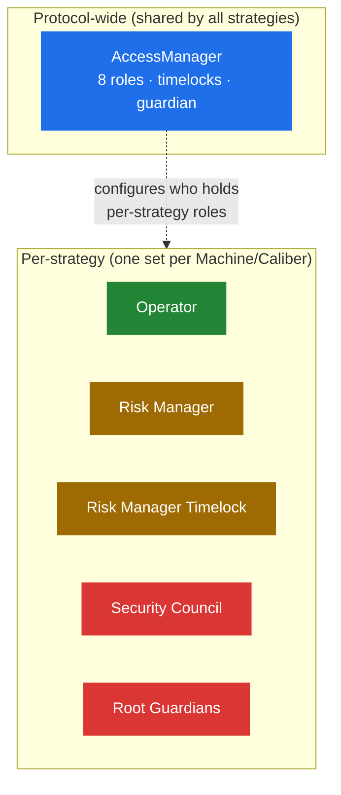

# Roles & Governance

Makina's safety doesn't come from trusting any single party. It comes from **separating powers** so that no one actor can both move funds and change the rules that bound them. This section explains who the actors are, what each can and cannot do, and the timelocks and vetoes that sit between intention and effect.

## Two layers of control

Permissions exist at two levels:

- **Protocol-wide permissions** are managed by a single **AccessManager** contract (one per chain), through a set of numbered roles. These govern shared infrastructure, strategy deployment, contract linking, and [upgrades](protocol-upgrades). Most roles act through **timelocks**, and a guardian can cancel scheduled actions. See [Permissions & Scopes](permissions-and-scopes).
- **Per-strategy permissions** are a set of addresses stored on each Machine and Caliber. These are the actors who run and oversee an individual strategy day to day.

## The per-strategy actors

| Actor                                    | What they do                                                                                         | Key constraint                                                                                                                                                              |
| ---------------------------------------- | ---------------------------------------------------------------------------------------------------- | --------------------------------------------------------------------------------------------------------------------------------------------------------------------------- |
| **[Operator](operator)**                 | Executes the strategy: manages positions, swaps, harvests, bridges liquidity.                        | Pre-approved instructions only, per-action loss caps and cooldowns, and no power to withdraw user funds.                                                                    |
| **[Risk Manager](risk-manager)**         | Proposes new instructions and sets the strategy's risk limits.                                       | Schedules the [instruction-root update](root-update-lifecycle). A few low-risk settings are immediate, but most parameter changes go through the **Risk Manager Timelock**. |
| **Risk Manager Timelock**                | The timelocked address through which the risk-sensitive parameter changes are actually applied.      | Enforces a delay so changes can't be atomic or unilateral.                                                                                                                  |
| **[Security Council](security-council)** | Emergency oversight: vetoes pending changes and triggers [Recovery Mode](../security/recovery-mode). | Cannot execute strategy actions in normal operation, only veto and emergency intervention. In Recovery Mode it _becomes_ the Operator.                                      |
| **Root Guardians**                       | Hold veto power specifically over [instruction-root updates](root-update-lifecycle).                 | Veto only, cannot propose or execute.                                                                                                                                       |

## Separation of powers

The roles are deliberately split so that the dangerous combinations are impossible:

- The **Operator** can act quickly but only within limits it cannot itself change.
- The **Risk Manager** sets those limits but cannot execute the strategy, and its changes are delayed by a timelock.
- The **Security Council** can stop bad changes and intervene in emergencies, but in normal operation cannot move funds or alter parameters on its own.
- **Protocol-wide governance** (the DAO, via the AccessManager) can upgrade and deploy, but only behind timelocks the Security Council can cancel.

Every consequential action is either bounded by limits it cannot exceed, or delayed by a timelock during which it can be vetoed, leaving time for monitoring and response before harm can occur. The pages that follow detail each actor, the [root-update lifecycle](root-update-lifecycle), the [permission roles](permissions-and-scopes), [protocol upgrades](protocol-upgrades), and the [multisig safeguards](safe-security-structure) that protect the keys behind these roles. For the emergency state itself, see [Recovery Mode](../security/recovery-mode).
