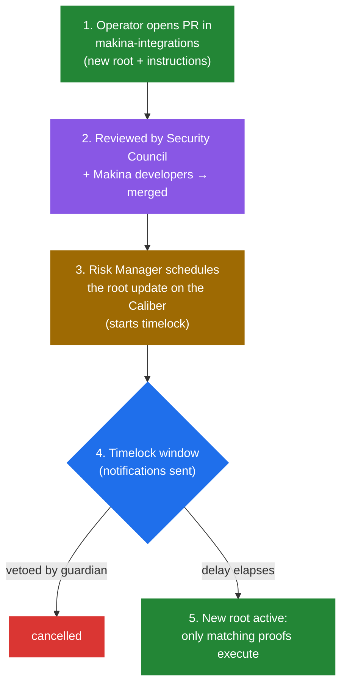

# Root Update Lifecycle

The set of actions an [Operator](operator) may take is defined by the [Merkle root](../caliber/makina-vm#merkle-tree-permissioning) of allowed instructions stored on each [Caliber](../caliber/overview). Changing that root is the single most security-critical governance action in a strategy: it expands or contracts what the Operator can do. It therefore follows a deliberate, multi-stage, vetoable process.

## The stages

1. **Propose.** The Operator opens a pull request in the public [`makina-integrations`](https://github.com/MakinaHQ/makina-integrations) repository containing the new root and the corresponding instructions. Because the instruction set is public, anyone can rebuild the tree and verify exactly what is being authorized.
2. **Review & merge.** The PR is reviewed by relevant parties before being merged.
3. **Schedule.** The [Risk Manager](risk-manager) takes the reviewed root and schedules the update on the relevant Caliber, which starts a **timelock**.
4. **Timelock window.** The scheduled update is visible on-chain, and notifications go out to the Security Council and community channels. Users who disagree with the upcoming change have time to [redeem](../machine/redemptions) before it takes effect.
5. **Activate.** If not vetoed, the new root takes effect when the timelock elapses. From then on, only instructions whose proofs match the new root are valid, and instructions removed by the update can no longer execute.

## Who can veto

During the timelock window, the scheduled update can be cancelled by:

- the **[Security Council](security-council)**,
- the **Root Guardians** (a configurable set of veto-holding addresses dedicated to this purpose), or
- the **Risk Manager** itself (withdrawing its own proposal).

This veto applies specifically to the instruction root, the heart of the Operator's permissions. The Operator's powers cannot be expanded if any of these parties objects.

:::info Implementation
The on-chain entry points for scheduling, vetoing, and activating a root update live in [`Caliber.sol`](/contracts/core/caliber/Caliber.sol/contract.Caliber.md).
:::
