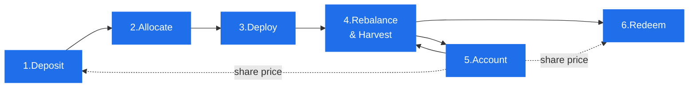
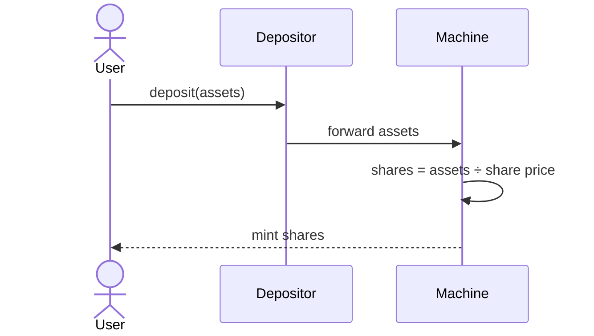
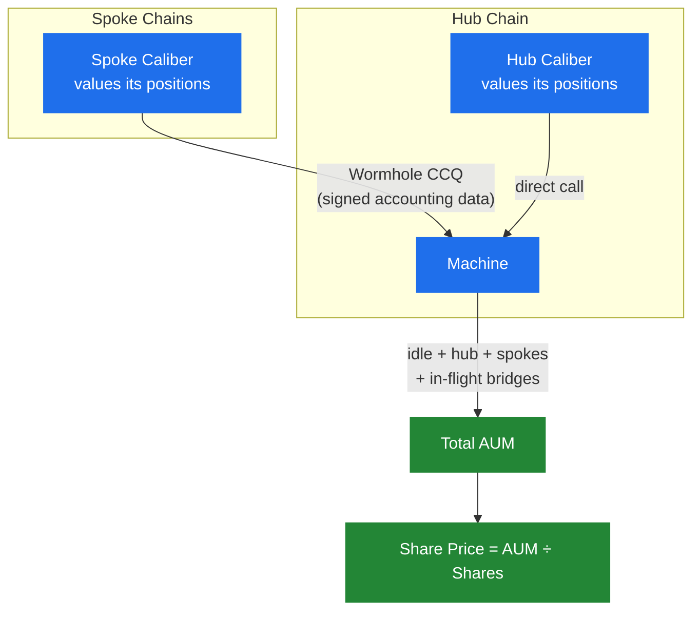
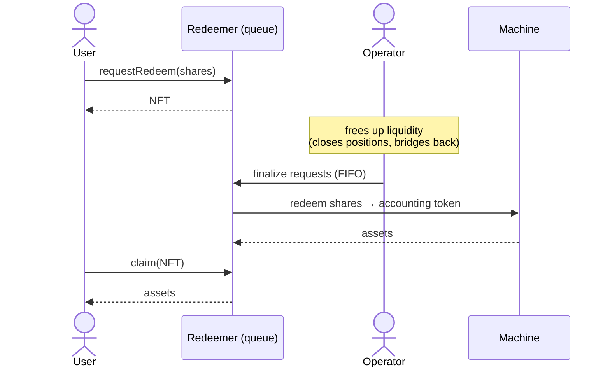

# Asset Lifecycle

This page follows capital through a Makina strategy end to end: how a deposit becomes shares, how those funds are deployed and rebalanced, how value is measured, and how a user eventually exits. Each step links to the section that covers it in depth.

## The big picture

Steps 3–5 form a continuous loop: the Operator keeps the capital working and the protocol keeps the valuation fresh, for as long as the strategy runs. Deposits (1–2) and redemptions (6) happen around that loop.

## 1. Deposit: capital enters, shares are minted

A user deposits the strategy's [accounting token](architecture#glossary) through the strategy's [Depositor](machine/deposits) contract. The Depositor forwards the assets to the [Machine](machine/overview), which mints [shares](machine/machine-token) to the user at the current [share price](machine/share-price).

The number of shares minted is `assets / share price`, so a deposit never changes the share price. It only scales the strategy up proportionally. Depending on the strategy, the Depositor may enforce a [whitelist](machine/deposits#whitelisting) (e.g. for KYC-gated strategies). See [Deposits](machine/deposits).

:::note Example implementation
The atomic "forward and mint instantly" flow shown here is the **[DirectDepositor](/contracts/periphery/depositors/DirectDepositor.sol/contract.DirectDepositor.md)**, one common depositor implementation. The Depositor is a swappable [periphery](architecture#core-vs-periphery) contract: some deployed strategies use the DirectDepositor, while others run custom logic built for a particular integrator's needs. The constant is that the Machine accepts deposits only from its designated Depositor.
:::

_Before a strategy launches, deposits can be gathered through a [Pre-Deposit Vault](machine/pre-deposit), which lets a strategy bootstrap liquidity and seamlessly transition into the live Machine._

## 2. Allocate: capital moves to where it will be deployed

Fresh deposits sit idle on the Machine's balance. To put them to work, the [Operator](governance/operator) transfers capital to a Caliber:

- To the **Hub Caliber**, a direct transfer on the same chain.
- To a **Spoke Caliber**, a cross-chain [bridge transfer](cross-chain/liquidity-bridging): a deliberate, multi-step process routed through approved bridge adapters.

The Operator decides how much to keep idle as a withdrawal buffer and how much to deploy. This allocation is itself a strategy decision, bounded by the risk policy.

## 3. Deploy: positions are opened

Within a Caliber, the Operator deploys [base tokens](caliber/base-tokens) into external protocols by executing [Instructions](caliber/makina-vm) on the [MakinaVM](caliber/makina-vm). Each deployment becomes a tracked [position](caliber/positions): a supply on a lending market, an LP position on a DEX, a deposit into a yield vault, and so on. Positions can also represent **debt** (e.g. a borrow), which counts negatively toward AUM.

Crucially, the Operator can only execute Instructions that governance has **pre-approved** and committed onchain. The Caliber verifies every action against a Merkle root of the allowed instruction set before running it (see [`allowedInstrRoot`](/contracts/core/caliber/Caliber.sol/contract.Caliber#allowedinstrroot)), and applies a [loss check](caliber/positions#loss-checks) comparing value before and after to ensure the deployment didn't leak value beyond a configured tolerance.

## 4. Rebalance & harvest: the strategy is actively managed

This is where returns are generated. On an ongoing basis the Operator:

- **Rebalances**: resizes, closes, and opens positions as opportunities and risks shift, [swapping](caliber/swaps) between tokens through approved routers as needed.
- **Harvests**: claims reward tokens from protocols and realizes them, typically by swapping them into base tokens. See [Harvests](caliber/harvests).
- **Moves liquidity across chains**: bridges capital between the Hub and Spokes to chase the best opportunities.

Every one of these actions is bounded: pre-approved instructions only, swaps only into approved base tokens, per-action **loss caps** and **cooldowns**, and bridging only over approved routes within a max-loss limit. These bounds are what let an Operator be flexible _without_ being trusted with unilateral control. See [Operator](governance/operator) for the full list of restrictions.

## 5. Account: value is measured and fees are taken

For the share price to be correct, the protocol must continuously know what every position is worth.

- Each Caliber values its [positions](caliber/positions) and base-token balances in the accounting token. Position values must be kept fresh: stale positions cause accounting to fail, so they are re-accounted regularly, by anyone when accounting is open or by the Operator and designated agents when the strategy restricts it (a common configuration). See [Caliber Accounting](caliber/caliber-accounting).
- Spoke Caliber values are carried to the Machine through [Wormhole Cross-Chain Queries](cross-chain/cross-chain-accounting), a pull-based, guardian-signed mechanism.
- The Machine sums **idle balance + Hub Caliber + all Spoke Calibers + in-flight bridge transfers** into total AUM, then derives the [share price](machine/share-price). In-flight bridges are counted so that value is never "lost" while crossing chains.
- When AUM is updated, [fees](machine/fees) are minted as new shares and distributed to the Operator, the protocol, and the [Security Module](security/security-module), subject to per-strategy rate caps and a minimum interval.

Because fees only crystallize on a complete accounting cycle, the Operator is incentivized to keep valuations accurate and up to date.

## 6. Redeem: capital exits

Positions are generally not instantly liquid, so Makina does not promise atomic withdrawals. Instead, redemption is a **queue**:

1. The user locks their shares in the [Redeemer](machine/redemptions) and receives an NFT representing the request.
2. The Operator frees up the required accounting token (closing positions and bridging liquidity back to the Hub if needed) and settles requests in first-in-first-out order. The shares are burned and the corresponding assets are reserved.
3. The user claims their assets by surrendering the NFT, at any time after settlement.

This asynchronous design is what lets a strategy stay fully invested while still honoring exits in an orderly, fair sequence. See [Redemptions](machine/redemptions).

:::note Example implementation
The FIFO, NFT-based queue shown here is the **[AsyncRedeemer](/contracts/periphery/redeemers/AsyncRedeemer.sol/contract.AsyncRedeemer.md)**, one common redeemer implementation. The Redeemer is a swappable [periphery](architecture#core-vs-periphery) contract: some deployed strategies use the AsyncRedeemer, while others run custom logic built for a particular integrator's needs. What is fundamental is that the Machine can only pay out from its idle balance. A Redeemer could settle atomically when that idle balance is sufficient, but because most of the capital is usually deployed, redemptions are generally handled asynchronously.
:::

## When something goes wrong

If the Operator misbehaves, goes inactive, or the share price moves abnormally, the [Security Council](governance/security-council) can trigger [Recovery Mode](security/recovery-mode). The Operator's powers transfer to the Council, new deposits stop, and the strategy is restricted to _unwinding only_: positions can be reduced, swaps can only move toward the accounting token, and bridging can only bring funds home. If a genuine shortfall occurs, the [Security Module](security/security-module) can be slashed to cover losses for share holders.

:::tip Next
You now have the full arc. Dive into any component: [Machine](machine/overview), [Caliber](caliber/overview), [Cross-Chain](cross-chain/hub-and-spoke), or [Roles & Governance](governance/overview).
:::
