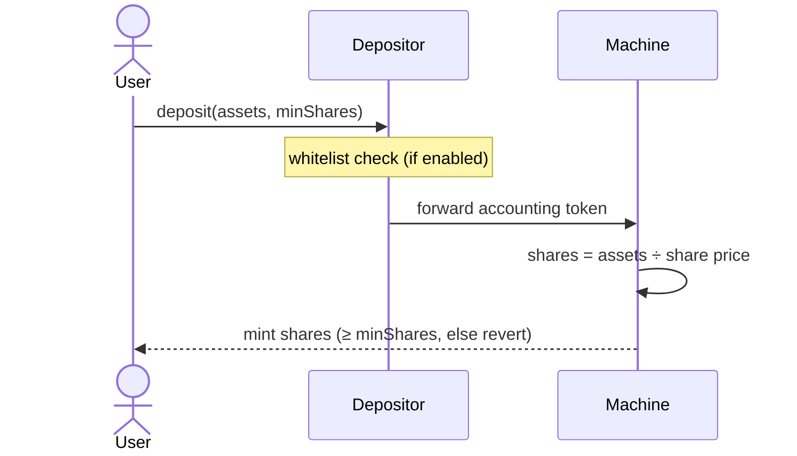

# Deposits

Users never call the [Machine](overview) directly. Instead, each Machine is linked to a dedicated **Depositor** contract (the strategy's official entry point), and the Machine accepts deposits _only_ from that contract. Routing deposits through a swappable periphery contract lets different strategies impose different deposit rules (for example, compliance gating) without changing the Machine itself.

A deposit is **atomic**: assets in, shares out, in a single transaction at the current [share price](share-price). The `minShares` parameter is a slippage guard: the call reverts if the share price moved unfavorably and the user would receive fewer shares than they accepted.

## Direct Depositor

The standard implementation, [`DirectDepositor`](/contracts/periphery/depositors/DirectDepositor.sol/contract.DirectDepositor.md), does exactly the flow above: it pulls the accounting token from the user, forwards it to the Machine, and the Machine mints shares to the user immediately.

### Whitelisting

The DirectDepositor supports an optional **whitelist**. When enabled, only approved addresses may deposit, the mechanism strategies use to restrict participation to, e.g., KYC-verified users. When disabled, deposits are open to anyone. The whitelist is toggled and managed by the [Risk Manager](../governance/risk-manager). The same whitelist primitive gates [redemptions](redemptions#whitelisting) and the [Pre-Deposit Vault](pre-deposit).

## Deposit limits

A Machine can enforce a **share supply cap** set by the [Risk Manager](../governance/risk-manager): once the total share supply reaches the cap, further deposits are rejected. This lets a strategy control its size, which is useful when capacity for good opportunities is limited.
