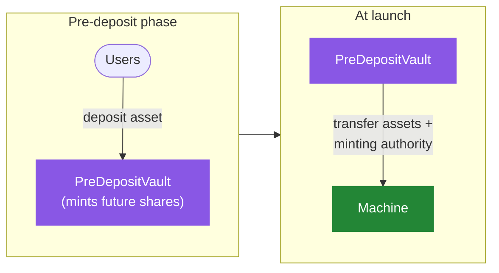

# Pre-Deposit

A strategy is more effective when it launches with capital already in hand: it can start diversified and allocate efficiently from day one rather than scaling up from zero. **Pre-deposits** let a strategy gather that baseline liquidity _before_ its [Machine](overview) goes live.

The [`PreDepositVault`](/contracts/core/pre-deposit/PreDepositVault.sol/contract.PreDepositVault.md) is a temporary vault that accepts a single **pre-deposit asset**, typically a yield-bearing token that:

- is **priceable** against the strategy's [accounting token](overview#the-accounting-token) through the [Oracle Registry](../oracles), and
- will later be enabled as a [base token](../caliber/base-tokens) of the strategy.

Depositors earn the pre-deposit asset's native yield during this phase: as the asset accrues value, the vault's share price rises with it.

## Seamless transition into the Machine

The key design choice is that the Pre-Deposit Vault mints the **shares of the future Machine**: the very same share token the live strategy will use. This makes the launch transition trivial:

When the Machine is deployed, **no user balances need to be migrated**. The vault simply hands the accumulated assets to the Machine and transfers the share token's minting authority to it. Holders keep the exact shares they already had, now backed by the live strategy. After migration the vault is closed to further deposits and redemptions.

Like the [Depositor](deposits#whitelisting), the Pre-Deposit Vault supports an optional whitelist and a share-supply cap, managed by the [Risk Manager](../governance/risk-manager).

