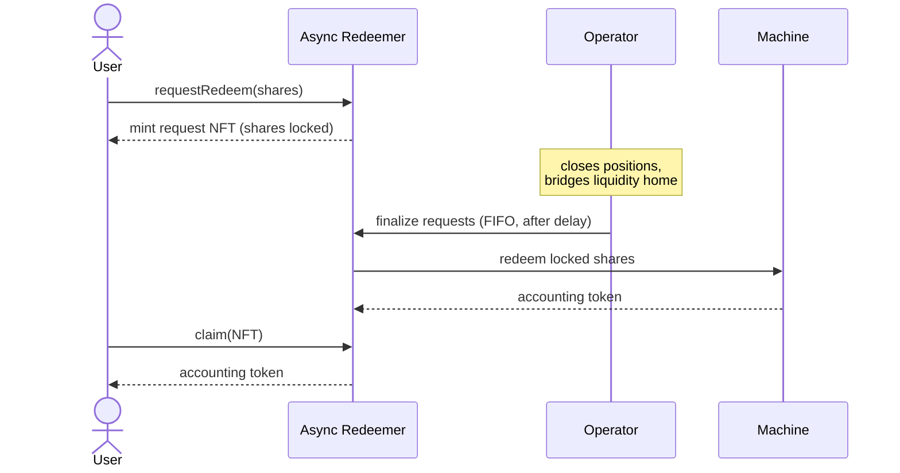

# Redemptions

To exit a strategy, a holder redeems [shares](machine-token) back into the [accounting token](overview#the-accounting-token). As with deposits, users never call the [Machine](overview) directly. Each Machine is linked to a dedicated **Redeemer** contract, and the Machine accepts redemptions only from it.

## Why redemptions are asynchronous

Most of a strategy's capital is deployed into [positions](../caliber/positions) that are not instantly liquid, and some of it may be on other chains. The Machine can only pay out from its **idle accounting-token balance**, which is usually a small buffer. A strategy therefore cannot promise instant, atomic withdrawals.

Redeemers are instead **queues**: the [Operator](../governance/operator) must free up liquidity (closing positions and [bridging](../cross-chain/liquidity-bridging) funds back to the Hub) before redemption requests can be settled. This is a normal, expected part of running a strategy.

## Async Redeemer

The standard implementation, [`AsyncRedeemer`](/contracts/periphery/redeemers/AsyncRedeemer.sol/contract.AsyncRedeemer.md), is a first-in-first-out queue built around an **ERC-721 receipt NFT**.

1. **Request.** The user locks their shares in the queue and receives an NFT representing the request. A minimum request size may apply.
2. **Finalize.** After a minimum **finalization delay**, the Operator settles requests in order, up to a chosen point in the queue. The queue redeems the locked shares against the Machine: the shares are burned and the corresponding accounting token is pulled into the queue and reserved for the claimants. Each request is settled at no more than the value quoted when it was made.
3. **Claim.** The NFT holder surrenders the NFT to receive their accounting token. There is no deadline to claim once a request is finalized.

The NFT representation means a pending redemption is itself transferable.

### Redemption fees

A variant, [`AsyncRedeemerFee`](/contracts/periphery/redeemers/AsyncRedeemerFee.sol/contract.AsyncRedeemerFee.md), applies a **redemption fee**: the assets a user receives are reduced by a configured rate. The withheld value remains in the strategy, accruing to the remaining share holders rather than going to a separate recipient. This can discourage churn or compensate the strategy for the cost of unwinding positions to honor exits.

### Whitelisting

Like the [DirectDepositor](deposits#whitelisting), the AsyncRedeemer supports an optional whitelist gating both _requesting_ a redemption and _claiming_ assets, used by strategies that restrict participation to approved addresses.

:::note
Settlement timing depends on the Operator freeing liquidity, and Makina does not force or guarantee a settlement schedule. The finalization delay and FIFO ordering ensure requests are handled fairly and in sequence.
:::
