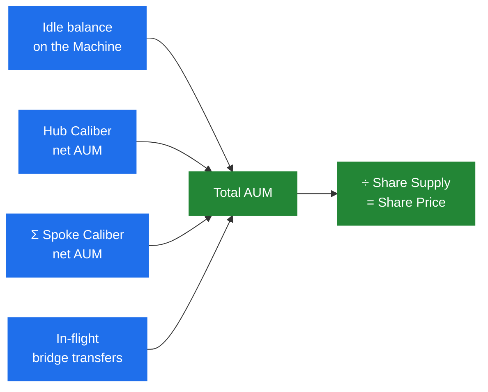

# Share Price & AUM

The **share price** is the value of one [share](machine-token) in [accounting-token](overview#the-accounting-token) terms. It is the single most important number a strategy produces: the Machine mints and redeems shares at it, and it is how holders measure their returns.

$$
\text{Share Price} = \dfrac{\text{AUM}}{\text{Share Supply}}
$$

Where **AUM** (assets under management) is the total value of everything the strategy controls. Successful execution by the [Operator](../governance/operator), through earned yield or appreciation of held assets relative to the accounting token, raises AUM, and because the share supply doesn't change when value accrues, the share price rises. Deposits and redemptions, by contrast, change AUM and supply _proportionally_, so they leave the share price unchanged.

## What goes into AUM

AUM is assembled from four sources:

$$
\text{AUM} = \text{Idle balance} + \text{Hub Caliber} + \sum \text{Spoke Calibers} + \text{In-flight bridges}
$$

- **Idle balance**: the accounting token and any other priceable tokens sitting on the Machine itself (recent deposits not yet deployed, capital just bridged back, or a deliberate buffer kept for redemptions). Each is priced via the [Oracle Registry](../oracles).
- **Hub Caliber**: the [net AUM](../caliber/caliber-accounting) of the Caliber on the Hub Chain, read directly.
- **Spoke Calibers**: the net AUM of each Caliber on other chains, carried to the Machine through the [Cross-Chain Accounting](../cross-chain/cross-chain-accounting) flow.
- **In-flight bridges**: capital that has left one chain but not yet arrived on the other. Bridging can take time, so the protocol explicitly tracks value _in transit_ and counts it, ensuring no value appears to vanish mid-transfer. See [Liquidity Bridging](../cross-chain/liquidity-bridging).

A Caliber's "net" AUM already nets out [debt positions](../caliber/positions#debt-positions), so leveraged strategies are valued correctly.

## Keeping AUM fresh

AUM is not recomputed on every block. It is updated on demand, in a single operation that re-reads every source and then mints any due [fees](fees). The update can be set either permissionless, or restricted to the [Operator](../governance/operator) and designated accounting agents (see [restricted accounting mode](../governance/permissions-and-scopes#restricted-accounting-mode)). For the update to succeed, the inputs must be **fresh**:

- Each Caliber's [position values must be up to date](../caliber/caliber-accounting) (not stale).
- Spoke Caliber data delivered by cross-chain queries must be recent enough.

If any input is stale, the update reverts rather than producing a wrong price. An update is also rejected if it would move the share price faster than a governance-set **maximum change rate** over the elapsed time, a guard against a sudden, suspicious jump. (The [Security Council](../governance/security-council) can update AUM bypassing that guard when legitimately needed.)

## Inflation protection

To prevent the classic "first depositor" share-inflation attack on empty or near-empty vaults, share-price and conversion math use **virtual offsets** (a virtual share supply and a virtual unit of AUM) rather than dividing by raw zero-or-tiny values. In normal operation, with a meaningful supply and AUM, this has no observable effect on the price. It simply makes the math safe at the boundaries.

:::info Implementation
See [`Machine.sol`](/contracts/core/machine/Machine.sol/contract.Machine.md) and the [`MachineUtils`](/contracts/core/libraries/MachineUtils.sol/library.MachineUtils.md) library.
:::
