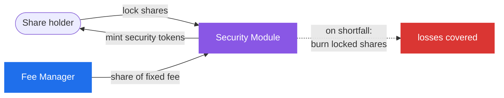

# Security Module

The **Security Module** is a strategy's **optional** insurance backstop. A strategy may run without one, but where it is configured it holds a reserve that can be **slashed to cover losses** if the strategy suffers a shortfall: from a hack, bad debt, a depeg, or any event that leaves AUM short of what share holders are owed. It is the protocol's last line of _loss absorption_, complementing [Recovery Mode](recovery-mode)'s last line of _loss prevention_.

## How it works: staking shares for protection

Holders of the [Machine Token](../machine/machine-token) can **lock** their shares in the Security Module and receive **security tokens** in return, a share-based claim on the locked pool (more locked value per security token over time as rewards accrue). In exchange for accepting slashing risk, stakers earn an **enhanced yield**: a dedicated portion of the strategy's minted [fee](../machine/fees) shares (the _Security Module fee_) flows to the module, raising the value of the locked pool.

If the [Security Council](../governance/security-council) determines a shortfall has occurred, it can **slash** the module: locked shares are burned, reducing the share supply and thereby lifting the [share price](../machine/share-price) back toward solvency for the remaining holders. Stakers bear the loss first, in return for the yield they earned.

## Unstake cooldown

Unstaking is not instant. To withdraw, a staker starts a **cooldown**:

1. They surrender their security tokens and receive a **receipt NFT** recording the pending amount and a maturity time.
2. After the cooldown matures, they redeem the NFT for the underlying shares.
3. Before maturity, the cooldown can be **cancelled**, returning the security tokens.

The cooldown exists to prevent **front-running a slash**: without it, a staker who saw a loss coming could collect the boosted yield and exit just before slashing, leaving honest stakers to absorb the hit. The Security Council sets the duration, with a **minimum of 7 days** recommended.

## Slashing limits

Slashing is capped so it can never wipe out the entire reserve unexpectedly. Two parameters bound it:

- a **maximum percentage** of the module's balance that may be slashed, and
- a **minimum balance that must remain** after a slash.

The **more restrictive** of the two applies. This guarantees a predictable ceiling on how much a single slashing event can burn.

:::info Implementation
Security Module reference: [`SecurityModule.sol`](/contracts/periphery/security-module/SecurityModule.sol/contract.SecurityModule.md). The fee that funds it is configured on the [`WatermarkFeeManager`](../machine/fees).
:::
