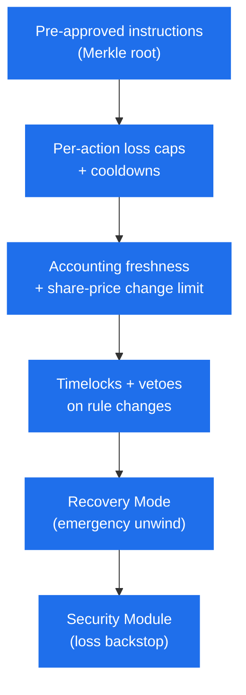

# Trust Model & Risk

This page sets out Makina's trust model: which actors and external systems the protocol relies on, the level of trust each is granted, and what could go wrong if one of them is compromised or fails. It consolidates the safeguards described throughout these docs into a single risk picture, and aligns with the trust model published in the protocol's [security audits](/contracts/security).

## Trust levels

Each role is classified into one of three levels:

- **Fully trusted.** Held by the protocol's governance multisigs. Their authority is broad enough to reach all user funds, so the system relies on the integrity of their keys and processes, protected by timelocks and [multisig safeguards](../governance/safe-security-structure).
- **Partially trusted.** Assumed to act honestly for the system to operate, but constrained by the contracts so they cannot withdraw user funds. Their influence is bounded to a limited loss or a temporary operational disruption.
- **Untrusted.** Granted no special privileges. The system is designed to remain safe against arbitrary behavior from them.

## Asset assumptions

Tokens used anywhere in the system ([base tokens](../caliber/base-tokens), [accounting tokens](../architecture#glossary), and deposit tokens) are assumed to be standard ERC20 tokens with **at most 18 decimals** and **no non-standard behavior**: no rebasing, no transfer hooks (reentrancy), and no fees on transfer. Whitelisting a token that violates these assumptions can break accounting, and is a governance responsibility.

## Role trust model

| Role                                                                                                     | Trust level       | Scope and limits                                                                                                                                                                                                                                                                                                                                                                                                                                             |
| -------------------------------------------------------------------------------------------------------- | ----------------- | ------------------------------------------------------------------------------------------------------------------------------------------------------------------------------------------------------------------------------------------------------------------------------------------------------------------------------------------------------------------------------------------------------------------------------------------------------------ |
| **[Governance](../governance/permissions-and-scopes)** (the scoped AccessManager roles)                  | Fully trusted     | Holds the protocol's highest authority: it configures every restricted function and controls contract [upgrades](../governance/protocol-upgrades). This authority is split into scoped roles (infra config, deployment, linking, management, fees, upgrades, guardian), each fully trusted within its own scope and exercised behind timelocks.                                                                                                              |
| **[Security Council](../governance/security-council)**                                                   | Fully trusted     | Holds the protocol's emergency authority: it vetoes [instruction-root updates](../governance/root-update-lifecycle), triggers [Recovery Mode](recovery-mode) (stepping into the Operator's role to unwind), resets bridging state, and can refresh AUM outside the share-price change guard. Because these powers reach accounting and the [share price](../machine/share-price), it is a high-threshold multisig. It holds no power to withdraw user funds. |
| **[Operator](../governance/operator)** (the `mechanic`)                                                  | Partially trusted | Executes routine strategy actions within [pre-approved instructions](../caliber/makina-vm). It cannot withdraw funds, set a position's withdrawal addresses, or change parameters, so its influence is bounded by the [loss caps](../caliber/positions#loss-checks) the Risk Manager configures. The role is actively monitored and replaceable.                                                                                                             |
| **[Risk Manager](../governance/risk-manager)** & Risk Manager Timelock                                   | Partially trusted | Adjust system parameters: the Risk Manager changes the share supply cap immediately, the Timelock changes risk-sensitive parameters (staleness thresholds, bridge-loss limits) after a delay. Neither can move funds. Their reach is operational, such as pausing deposits via the supply cap, and any new instruction is vetoable by the Security Council or the Root Guardians.                                                                            |
| **Root Guardians**                                                                                       | Partially trusted | Hold veto power over queued instruction-root updates. Their role is purely to block: a single veto stops an update, and they cannot move funds or propose changes of their own.                                                                                                                                                                                                                                                                              |
| **Accounting Agents**                                                                                    | Partially trusted | When [restricted accounting mode](../governance/permissions-and-scopes#restricted-accounting-mode) is enabled, only these addresses (plus the Operator and Security Council, which always qualify) may perform accounting. They cannot move funds, and their effect on the share price is bounded per update by the change-rate guard.                                                                                                                       |
| **[Depositor](../machine/deposits), [Redeemer](../machine/redemptions), [Fee Manager](../machine/fees)** | Partially trusted | Smart contracts that handle the deposit, redemption, and fee flows respectively. Each is scoped to the funds passing through its own flow and holds no authority over the rest of the system. The Fee Manager can mint at most the maximum configured fee.                                                                                                                                                                                                   |
| **End users**                                                                                            | Untrusted         | Hold and transfer machine tokens only. They have no execution rights in the core contracts, and interact through the Depositor and Redeemer rather than the Machine directly.                                                                                                                                                                                                                                                                                |

In normal operation the principle is **separation of powers**: the [Operator](../governance/operator) can _act_ but cannot change the _rules_ it works under, and the [Risk Manager](../governance/risk-manager) sets those rules but cannot _act_. The [Security Council](../governance/security-council) sits outside this split, by design, as the emergency backstop that can both veto rule changes and step in as the Operator. That dual power is precisely why it is fully trusted. Consequential rule changes are delayed and vetoable. See [Roles & Governance](../governance/overview).

## Upgradeability

The core contracts (Machine, Caliber, and Caliber Mailbox) are **upgradeable**. Whoever controls the upgrade mechanism (the `INFRA_UPGRADE_ROLE`, part of Governance) can change the entire logic of the system, and in the worst case all deposited funds could be stolen. This power sits behind a **2-day timelock** that the Security Council can cancel. See [Protocol Upgrades](../governance/protocol-upgrades).

## External dependencies

Makina's security also depends on external systems that lie outside its own contracts:

- **Oracles.** Asset valuation and AUM rely on the price feeds registered in the [Oracle Registry](../oracles), which conform to the Chainlink `AggregatorV3` interface. They are assumed to provide accurate, timely prices. A manipulated or lagging feed could materially mis-calculate the share price. The protocol mitigates this with staleness and sanity checks and with per-action loss checks, but cannot eliminate it.
- **Bridge protocols.** The [bridge adapters](../cross-chain/liquidity-bridging) integrate third-party bridges (Across, CCTP, and LayerZero). A vulnerability in an underlying bridge could permanently lose funds in transit.
- **Wormhole.** [Cross-chain AUM](../cross-chain/cross-chain-accounting) is relayed from spokes via messages signed by Wormhole guardians. The system trusts that at least two-thirds of the guardian set is honest and signs only valid, untampered messages.
- **L2 and spoke infrastructure.** For every spoke chain, the system implicitly trusts that network's sequencer and data-availability layer. A faulty or malicious sequencer could censor or reorder transactions, affecting AUM or causing a denial of service.

## Defense in depth

No single control is relied upon. The protocol layers independent safeguards so that a failure of one is caught by others:

- **Action-level:** instructions, loss caps, cooldowns, and swap/bridge restrictions cap how much value can move wrongly in any single step or short window.
- **Accounting-level:** [staleness checks](../caliber/caliber-accounting) and the [share-price change-rate limit](../machine/share-price#keeping-aum-fresh) stop a wrong or manipulated valuation from propagating into the price.
- **Governance-level:** [timelocks](../governance/root-update-lifecycle) and vetoes ensure rule changes are slow, visible, and stoppable.
- **Emergency-level:** [Recovery Mode](recovery-mode) freezes normal operation and restricts the strategy to unwinding.
- **Loss-absorption:** where a strategy configures one, the [Security Module](security-module) can be slashed to cover a genuine shortfall for share holders.

## Residual risks

Bounding risk is not eliminating it. Users should understand that:

- **Strategy / market risk** is real. A strategy can lose value through market moves, even when every safeguard works exactly as intended. The protocol caps _misbehavior_, not market exposure. The strategy's [mandate](../introduction#the-strategy-mandate) describes its intended risk profile.
- **Smart-contract risk** exists in any protocol. Makina has undergone [multiple independent audits](/contracts/security) and runs a bug bounty, but no audit guarantees the absence of bugs.
- **Key-compromise risk**: the fully and partially trusted roles are multisigs with [safeguards](../governance/safe-security-structure), but multisig compromise remains a tail risk, which is why timelocks and the Security Council exist as backstops.

## Where to read more

- [Recovery Mode](recovery-mode): the emergency state and exactly what it restricts.
- [Security Module](security-module): how losses are absorbed.
- [Roles & Governance](../governance/overview): who controls what.
- [Security & Audits](/contracts/security): audit reports, bug bounty, and SEAL Safe Harbor.
