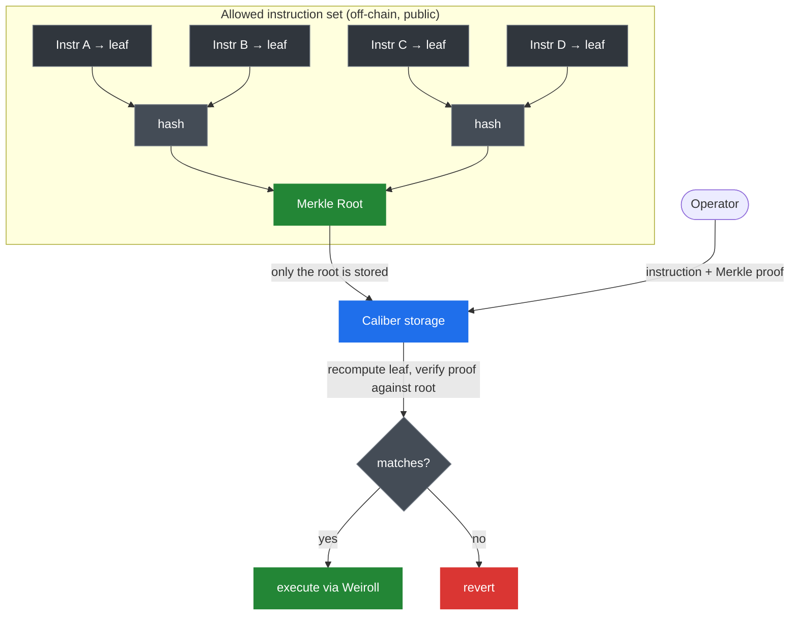
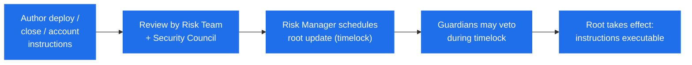

# MakinaVM & Instructions

The **MakinaVM** is Makina's central innovation and the reason a Caliber can be both flexible and safe.

Integrating a vault with an external protocol traditionally means writing, auditing, and deploying a custom adapter contract for each integration: slow, expensive, and a fresh attack surface every time. The MakinaVM replaces that model with a **scope-limited, generalized execution engine**: a single on-chain interpreter that can call almost any protocol, but only through actions that governance has reviewed and committed in advance.

## Instructions

The unit of action is an **Instruction**: a pre-approved, parameterized sequence of contract calls the Operator is allowed to execute. Instructions define and constrain exactly what the Operator can do in a given strategy. Adding a new integration means authoring its Instructions and committing them once, not deploying new code.

### Built on Weiroll

Instructions are expressed in [Enso Weiroll](https://github.com/EnsoBuild/enso-weiroll), an extended version of the [Weiroll](https://github.com/weiroll/weiroll) command-chaining framework. Weiroll enables **stateful multicalls**: a list of commands where the output of one call can be fed as input to the next. For instance, a single Instruction could chain together an approval, a deposit, and a balance read (across multiple protocols) into one atomic, composable operation. That is a simple case, and Instructions can encode far more elaborate sequences.

A Weiroll instruction has two parts:

- **commands**: the encoded sequence of calls (each fixing a target address, function selector, and how arguments and outputs are wired between steps);
- **state**: the array of values (token addresses, amounts, recipients, …) the commands read from and write to.

### Merkle-tree permissioning

The MakinaVM restricts _which_ instructions can run using a **Merkle tree**. Every allowed instruction is hashed into a leaf, and only the tree's **root** is stored on-chain in the Caliber.

To execute, the Operator submits the instruction plus a **Merkle proof**. The Caliber recomputes the leaf and checks it against the stored root. If it doesn't match, the call reverts. This design is:

- **Minimal on-chain**: only one 32-byte root is stored no matter how many instructions are allowed.
- **Cheap to update**: adding or removing instructions is a single root update.
- **Scalable**: proof size grows only logarithmically with the number of instructions.
- **Transparent**: anyone can rebuild the tree from the public instruction set and verify the on-chain root.

#### Fine-grained, down to the argument

A leaf hashes the instruction's full shape: its commands, its type, the target position, the affected tokens, and a **bitmap that marks which state values are fixed**. Values flagged as fixed (e.g. the protocol address or recipient) must match the approved instruction exactly, while values left unflagged (e.g. a token _amount_) are free to vary at execution time. This is what lets one approved instruction handle deposits of _any size_ while still pinning down _where_ and _how_ the funds may go.

### The four instruction types

Instructions are categorized by role:

| Type                     | Purpose                                                                                                                                                                                                             |
| ------------------------ | ------------------------------------------------------------------------------------------------------------------------------------------------------------------------------------------------------------------- |
| **Accounting**           | Reads and reports a position's current value, in base-token amounts. It is not intended to move funds, only to measure them.                                                                                        |
| **Management**           | Changes a position's size (open, increase, decrease, close). Always paired with an Accounting instruction so the Caliber can measure the position before and after and apply a [loss check](positions#loss-checks). |
| **Harvest**              | Claims external rewards into the Caliber. Receive-only, and cannot spend the Caliber's existing holdings. See [Harvests](harvests).                                                                                 |
| **Flashloan-Management** | A Management step executed _inside_ a flash loan, nested within an outer Management instruction and only valid in that scope. See [Flash Loans](flash-loans).                                                       |

## Integrating a new protocol

Integrating a protocol requires only authoring its instructions and committing the new Merkle root through governance. There is no new contract to deploy. Updates pass through a **timelock** during which they can be vetoed, giving users time to react. Over time a shared, reusable library of instructions grows, and protocols seeking capital are expected to contribute their own, a model of self-integration.

The full update and veto process is described in [Root Update Lifecycle](../../governance/root-update-lifecycle).

:::info[Instruction sets]
The instruction sets live in the public [`makina-integrations`](https://github.com/MakinaHQ/makina-integrations) repository, where anyone can review them and contributors add new integrations.
:::

:::info[Implementation]
The instruction structures and verification live in [`Caliber.sol`](/contracts/core/caliber/Caliber.sol/contract.Caliber.md) and [`ICaliber`](/contracts/core/interfaces/ICaliber.sol/interface.ICaliber.md). The Weiroll VM interface is [`IWeirollVM`](/contracts/core/interfaces/IWeirollVM.sol/interface.IWeirollVM.md).
:::
