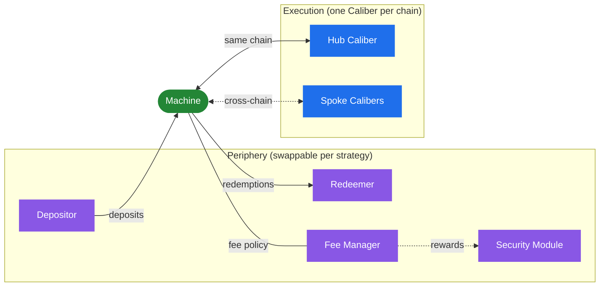

# Machine

The **Machine** is a strategy's vault and accounting layer, the main touch point for users and the contract that ties the whole strategy together. There is exactly one Machine per strategy, and it always lives on the [Hub Chain](../cross-chain/hub-and-spoke).

The Machine has four jobs:

- **Custody the strategy's reserves and issue shares.** It holds idle capital, mints the [machine token](machine-token) to depositors, and burns it on redemption.
- **Account for the whole strategy.** It aggregates the value of its idle balance, the Hub [Caliber](../caliber/overview), and every Spoke Caliber into a single total AUM, and derives the [share price](share-price) from it.
- **Charge fees.** When AUM is updated, it mints and distributes [fees](fees) according to its [Fee Manager](fees).
- **Coordinate cross-chain liquidity.** It is the hub endpoint for [bridging](../cross-chain/liquidity-bridging) capital to and from Spoke Calibers.

## The accounting token

Each Machine defines a single **accounting token**, for example USDC, WETH, or WBTC. This token is special in several ways:

- It is the **only** token users can deposit and the only token they receive on redemption.
- It is the **unit of account**: AUM and share price are denominated in it.
- Every other asset the strategy holds is valued _relative to_ the accounting token, through the [Oracle Registry](../pricing-oracles).

You can see the accounting token (and all other contracts) for each live strategy on the [Strategies](../../../strategies/deployments.md) page or in the [Makina app](https://app.makina.finance/explore).

## What a Machine is connected to

A Machine is linked to a set of **periphery** contracts, each of which can be a different implementation depending on the strategy's needs (see [Architecture → core vs. periphery](../overview#core-vs-periphery)):

- a [Depositor](deposits), the entry point for deposits;
- a [Redeemer](redemptions), the exit queue for redemptions;
- a [Fee Manager](fees), the fee policy;
- optionally a [Security Module](../../security/security-module), an insurance backstop.

It is also connected to the [Hub Caliber](../caliber/overview) on its own chain and, for multi-chain strategies, to [Spoke Calibers](../cross-chain/hub-and-spoke) on other chains.

## Flexibility

Because deposit rules, redemption flows, and fee models are delegated to swappable periphery contracts, and because asset deployment happens in [Calibers](../caliber/overview) through a generalized [execution engine](../caliber/makina-vm), a single Machine design supports a wide range of strategies, from yield aggregation and fixed income to volatile token indexes and hedged positions.

## Operational state

The Machine, like the Caliber, is _governable_: a set of per-strategy roles ([Operator](../../governance/operator), [Risk Manager](../../governance/risk-manager), [Security Council](../../governance/security-council)) can configure parameters and intervene, each within tightly scoped permissions. It can also be placed into [Recovery Mode](../../security/recovery-mode), an emergency state that disables deposits and restricts the strategy to unwinding. See [Roles & Governance](../../governance/overview).

:::info[Implementation]
Machine contract reference: [`Machine.sol`](/contracts/core/machine/Machine.sol/contract.Machine.md).
:::
