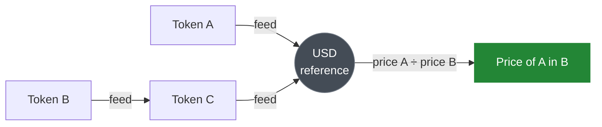

# Pricing & Oracles

Everything Makina does rests on one ability: **valuing any token in terms of the [accounting token](overview#glossary)**. Share price, AUM, loss checks, and risk caps are all denominated that way. The contract that provides this is the **Oracle Registry**, shared [infrastructure](overview#shared-infrastructure) deployed once per chain and used by every strategy on it.

## How pricing works

The Oracle Registry aggregates price feeds that conform to the [Chainlink `AggregatorV3` interface](https://docs.chain.link/data-feeds/price-feeds). These can be Chainlink's own feeds or any other oracle that exposes the same interface. The protocol depends on the interface, not on a specific feed provider. It prices each token against a common **reference currency** (e.g. USD) and then derives any token-to-token price by combining the two. A token reaches the reference currency through **one or two feed hops**:

- **One hop**: a direct feed exists (e.g. `TokenA → USD`).
- **Two hops**: no direct feed exists, so the token is priced through an intermediate (e.g. `TokenB → TokenC → USD`).

To price **Token A in Token B**, the registry prices each against the reference currency (one or two hops each) and divides. The math normalizes for each feed's and each token's decimals, so callers get a clean, consistent price regardless of the tokens' native precision.

## Rejecting stale or invalid prices

Each feed in a route has a configured **staleness threshold**. When the registry reads a feed it rejects the price if it is **negative** or if the feed hasn't updated within its threshold, so a stalled or malfunctioning feed causes a clear revert rather than a silently wrong valuation. Combined with the Caliber's [loss checks](caliber/positions#loss-checks), this keeps a bad price from translating into a bad trade.

## Where it's used

The Oracle Registry is consulted whenever value must be measured:

- **Token balances**: valuing the [base tokens](caliber/base-tokens) and idle balances held by Machines and Calibers.
- **Position valuation**: converting a [position's](caliber/positions) reported base-token amounts into accounting-token value.
- **Loss checks**: verifying, after each [position management](caliber/positions#loss-checks) or [swap](caliber/swaps), that value loss stays within bounds.

Which feeds and routes are registered for which tokens is governed configuration, managed by the protocol's infrastructure-configuration role behind a [timelock](../governance/permissions-and-scopes). A token cannot become a [base token](caliber/base-tokens) until a valid route exists for it here.

:::info[Implementation]
Oracle Registry reference: [`OracleRegistry.sol`](/contracts/core/registries/OracleRegistry.sol/contract.OracleRegistry.md).
:::
