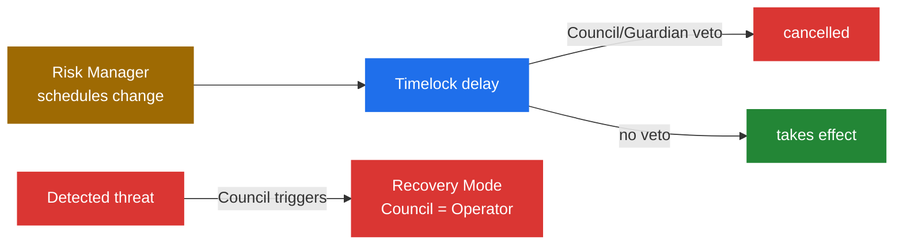

# Security Council

The **Security Council** is the strategy's emergency oversight body and its final line of defense. It holds no power to run the strategy in normal times: it cannot open positions or change parameters at will. Its job is to **watch, veto, and intervene** when something threatens user funds.

## Responsibilities

- **Veto pending changes.** The Council reviews timelocked changes scheduled by the [Risk Manager](risk-manager) (especially [instruction-root updates](root-update-lifecycle)) and can cancel any that introduce unacceptable risk before they take effect.
- **Trigger [Recovery Mode](../security/recovery-mode).** In response to a hack, Operator or Risk Manager misbehavior, abnormal share-price movement, or funds otherwise at risk, the Council can put the strategy into Recovery Mode. While active, the Council **assumes the Operator's role** and the strategy is restricted to unwinding only.
- **Initiate Security Module slashing.** When a genuine shortfall occurs, and where the strategy has a [Security Module](../security/security-module) configured, the Council can trigger its slashing to cover losses for share holders.
- **Bypass the share-price guard when legitimate.** The Council can force an [AUM update](../architecture/machine/share-price#keeping-aum-fresh) even when the share-price change exceeds the normal rate limit, useful when a large, legitimate move must be reflected.

Unlike the [Operator](operator) and [Risk Manager](risk-manager), whose powers are bounded by limits they cannot exceed, the Security Council is a **fully trusted** actor. Several of its powers are immediate, unilateral, and destructive if misused:

- During [Recovery Mode](../security/recovery-mode) it assumes the Operator's role (itself still bounded by the instruction set and loss caps).
- It can reset a token's [bridging state](../architecture/cross-chain/liquidity-bridging), force-withdrawing pending funds from the bridge adapters and clearing that token's in-flight accounting.
- As an always-authorized accounting source, it can force an [AUM update](../architecture/machine/share-price#keeping-aum-fresh) even when the change exceeds the share-price rate limit.
- Where a [Security Module](../security/security-module) is configured, it can trigger slashing, seizing staked funds (up to a configured cap) to cover a shortfall.

The Security Council is a multisig protected by the safeguards described in [Multisig Security](safe-security-structure), and at the protocol-wide level it holds the **Guardian role** that can cancel scheduled [upgrades](protocol-upgrades).
