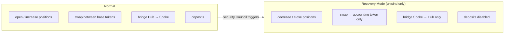

# Recovery Mode

**Recovery Mode** is the protocol's emergency state. When triggered, it strips the [Operator](../governance/operator) of its normal powers and restricts the strategy to **unwinding only**: the goal shifts from generating returns to protecting and consolidating what remains.

## When it is triggered

Only the [Security Council](../governance/security-council) can enter or exit Recovery Mode, at its discretion, in situations such as:

- the Operator has been **inactive** for an extended period;
- the **share price behaves abnormally** (a sudden spike or drop);
- **suspicious activity** suggests Operator deviation, a hack, or funds otherwise at risk.

## What it does

Entering Recovery Mode **transfers the Operator's role to the Security Council**: the `operator()` getter now returns the Security Council, so all operator-gated actions require the Council, and the normal Operator is locked out. On top of that handover, the permitted actions are narrowed to those that only ever _reduce_ risk:

**On each [Caliber](../architecture/caliber/overview):**

- Positions can only be **decreased or closed**. Opening or increasing a position is blocked.
- [Swaps](../architecture/caliber/swaps) may only convert **toward the accounting token**.

**On the [Machine](../architecture/machine/overview):**

- New **deposits are disabled**.
- Outbound **Hub → Spoke** [bridge transfers](../architecture/cross-chain/liquidity-bridging) are blocked.
- **AUM updates are restricted to the Security Council** (rather than the parties that handle accounting in normal operation): accounting continues, but only under Council control. This lets the Council keep the valuation current without an open accounting surface during the emergency.

## Scope and exit

Recovery Mode is **per-chain**. The Machine and Hub Caliber are governed on the Hub Chain, and **each Spoke Caliber must have Recovery Mode activated independently** on its own [Caliber Mailbox](../architecture/cross-chain/caliber-mailbox). A live incident may therefore need to be addressed on several chains.

Exiting is likewise at the Security Council's discretion, once the strategy's state is judged stable and secure. If a genuine shortfall is realized while unwinding and the Machine has a [Security Module](security-module) configured, the Council can also trigger its slashing to cover the loss for share holders.
