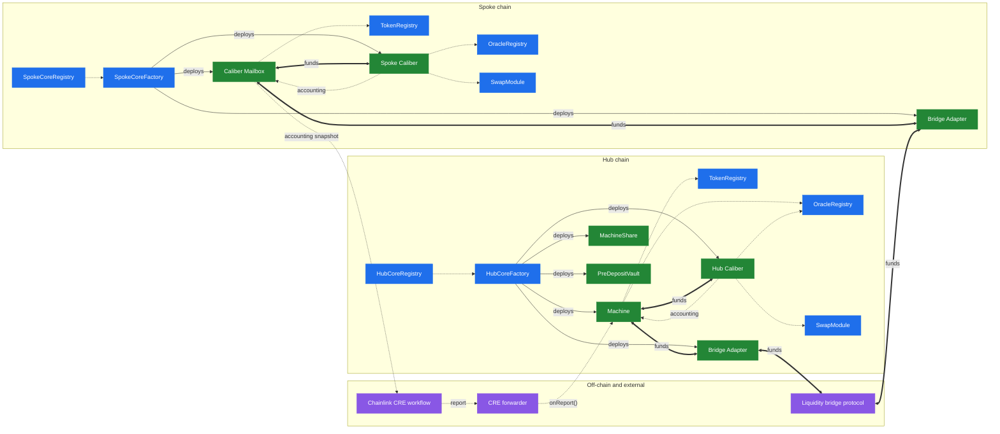

# Architecture Overview

This section provides a technical overview of Makina's core smart contracts. The diagram below illustrates the core contract interactions on a hub chain and on a spoke chain, distinguishing between protocol-wide contracts shared across all strategies and per-strategy contracts.

- **Blue** nodes are protocol-wide contracts, deployed once per chain for an instance; **green** nodes are per-strategy contracts created by the factories; **purple** nodes are external systems.
- Thick arrows are fund transfers, solid arrows are deployments, and dotted arrows are data flows (registry lookups, pricing, swaps, accounting).
- `OracleRegistry` and `TokenRegistry` are shared by every instance present on a chain; the registries, factories, `SwapModule` and beacons are specific to one instance.
