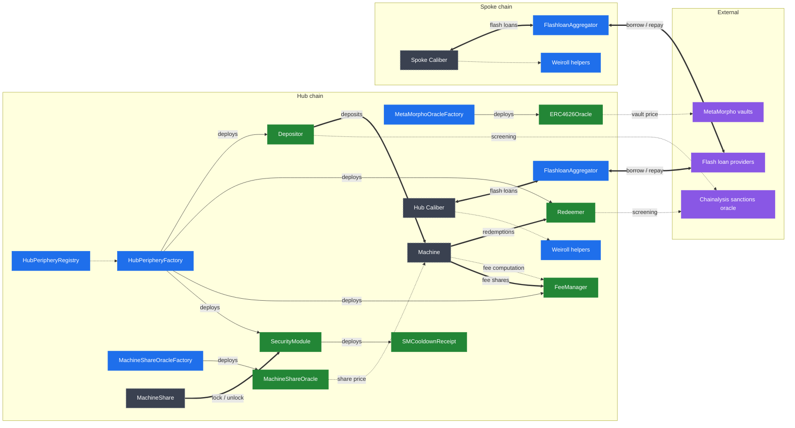

# Architecture Overview

This section provides a technical overview of Makina's periphery smart contracts. The diagram below illustrates how the periphery contracts plug into a Machine and its Calibers, distinguishing between protocol-wide contracts shared across all strategies and per-strategy contracts.

- **Blue** nodes are protocol-wide periphery contracts, deployed once per chain for an instance; **green** nodes are per-strategy contracts created by the factories; **dashed grey** nodes are the [core contracts](../core/architecture-overview) the periphery attaches to; **purple** nodes are external systems.
- Thick arrows are fund or token transfers, solid arrows are deployments, and dotted arrows are data flows (registry lookups, pricing, fee computation, sanctions screening).
- Each Machine points at exactly one Depositor, Redeemer and Fee Manager, and optionally a Security Module and a MachineShareOracle. The FlashloanAggregator and the Weiroll helpers are called by Calibers on every chain of an instance.
